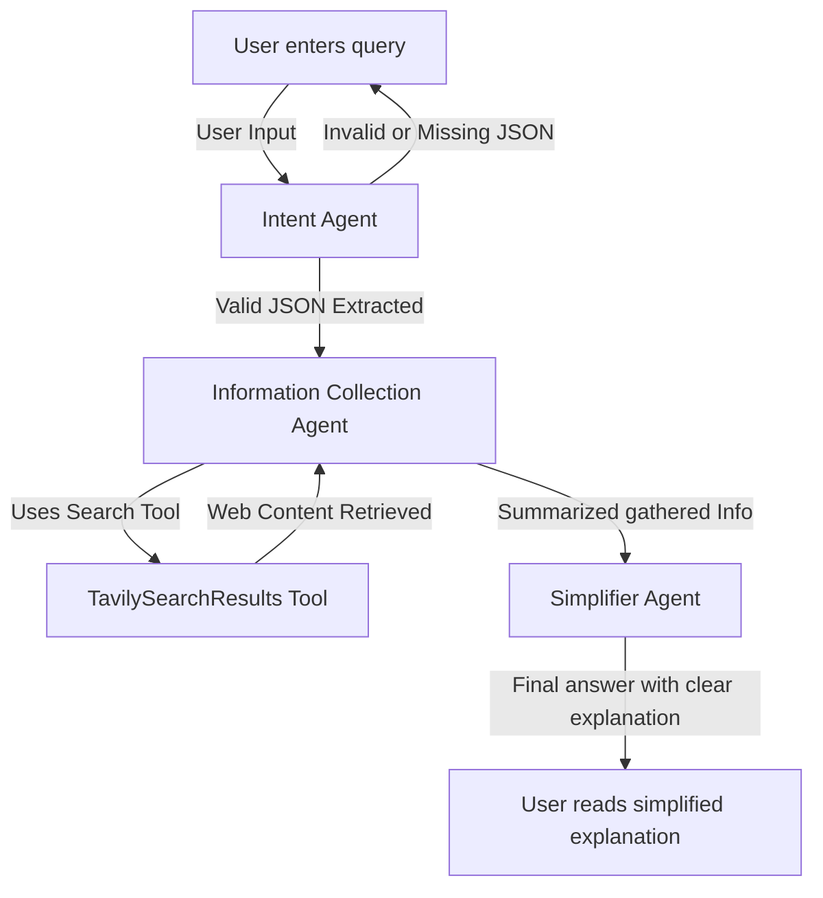
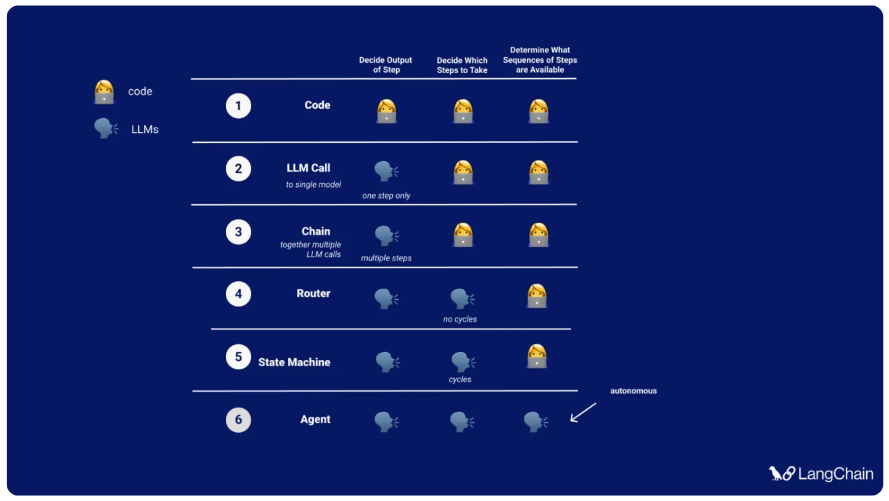
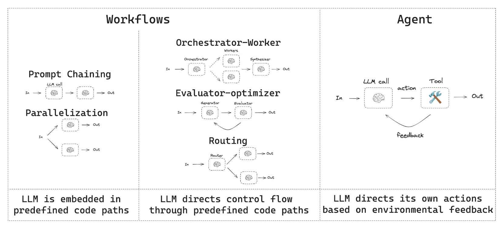

# Smart Explainer – Educational System:

## Overview & Use Case:

Smart Explainer is a lightweight, intelligent multi-agent system that takes any Data Science / AI question and returns a clear, accurate, and beautifully simple explanation — even for complex topics.

# Architecture:

```mermaid
graph TD

    %% User Input
    A[User enters query]

    %% Intent Agent
    A --> |User Input| B[Intent Agent]

    %% If Router output invalid or incomplete
    B --> |Invalid or Missing JSON| A

    %% Info Collection Agent
    B --> |Valid JSON Extracted| C[Information Collection Agent]

    %% Tool call path: Tavily web search
    C --> |Uses Search Tool| D[TavilySearchResults Tool]
    D --> |Web Content Retrieved| C

    %% Always summarize information when done
    C --> |Summarized gathered Info| E[Simplifier Agent]

    %% Simplifier Agent produces final explanation
    E --> |Final answer with clear explanation| H[User reads simplified explanation]

```

# LangGraph:
LangGraph is module built on top of LangChain to better enable creation of cyclical graphs, often needed for agent runtimes.

One of the common patterns we see when people are creating more complex LLM applications is the introduction of cycles into the runtime. These cycles often use the LLM to reason about what to do next in the cycle. A big unlock of LLMs is the ability to use them for these reasoning tasks. This can essentially be thought of as running an LLM in a for-loop. These types of systems are often called agents.

The simplest - but at the same time most ambitious - form of these is a loop that essentially has two steps:

1. Call the LLM to determine either (a) what actions to take, or (b) what response to give the user
2. Take given actions, and pass back to step 1

These steps are repeated until a final response is generated. This is essentially the loop that powers our core AgentExecutor, and is the same logic that caused projects like AutoGPT to rise in prominence. This is simple because it is a relatively simple loop. It is the most ambitious because it offloads pretty much ALL of the decision making and reasoning ability to the LLM.

These state machines have the power of being able to loop - allowing for handling of more ambiguous inputs than simple chains. However, there is still an element of human guidance in terms of how that loop is constructed.

LangGraph is a way to create these state machines by specifying them as graphs.

# Functionality:

At it's core, LangGraph exposes a pretty narrow interface on top of LangChain.

## StateGraph:

StateGraph is a class that represents the graph. You initialize this class by passing in a state definition. This state definition represents a central state object that is updated over time. This state is updated by nodes in the graph, which return operations to attributes of this state (in the form of a key-value store).

The attributes of this state can be updated in two ways. First, an attribute could be overridden completely. This is useful if you want to nodes to return the new value of an attribute. Second, an attribute could be updated by adding to its value. This is useful if an attribute is a list of actions taken (or something similar) and you want nodes to return new actions taken (and have those automatically added to the attribute).

## Nodes:

After creating a StateGraph, you then add nodes with graph.add_node(name, value) syntax. The name parameter should be a string that we will use to refer to the node when adding edges. The value parameter should be either a function or LCEL runnable that will be called. This function/LCEL should accept a dictionary in the same form as the State object as input, and output a dictionary with keys of the State object to update.

There is also a special END node that is used to represent the end of the graph. It is important that your cycles be able to end eventually!

## Edges:
After adding nodes, you can then add edges to create the graph. There are a few types of edges.

**1. The Starting Edge**

This is the edge that connects the start of the graph to a particular node. This will make it so that that node is the first one called when input is passed to the graph.

**2. Normal Edges**

These are edges where one node should ALWAYS be called after another. An example of this may be in the basic agent runtime, where we always want the model to be called after we call a tool.

**3. Conditional Edges**

These are where a function (often powered by an LLM) is used to determine which node to go to first. To create this edge, you need to pass in three things:

(a) The upstream node: 

the output of this node will be looked at to determine what to do next

(b) A function:

 this will be called to determine which node to call next. It should return a string

(c) A mapping:

 this mapping will be used to map the output of the function in (2) to another node. The keys should be possible values that the function in (2) could return. The values should be names of nodes to go to if that value is returned.

## Compile:

After we define our graph, we can compile it into a runnable! This simply takes the graph definition we've created so far an returns a runnable. This runnable exposes all the same method as LangChain runnables (.invoke, .stream, .astream_log, etc) allowing it to be called in the same manner as a chain.

# Workflows:

## References:
https://blog.langchain.com/langgraph/