# Multi-Agent Interview Simulator:

A technical interview simulator built with **Google Vertex AI Agent Builder** and **LangGraph**. This application orchestrates multiple AI agents to analyze resumes, conduct adaptive technical interviews, and provide detailed evaluations.

# Veretex AI Agent Builder & Agent Engine
Vertex AI Agent Builder is a suite of products that help developers build, scale, and govern AI agents in production. Vertex AI Agent Builder provides a full-stack, secure foundation that supports the entire agent lifecycle.


# Vertex AI Agent Engine

Vertex AI Agent Engine, a part of the Vertex AI Platform, is a set of services that enables developers to deploy, manage, and scale AI agents in production. Agent Engine handles the infrastructure to scale agents in production so you can focus on creating applications.


**Runtime:** 
- Deploy and scale agents with a managed runtime and end-to-end management capabilities.
- Customize the agent's container image with build-time installation scripts for system dependencies.
- Access models and tools such as function calling.
- Deploy agents built using different Python frameworks and the Agent2Agent open protocol.

**Quality and evaluation (Preview):** 
- Evaluate agent quality with the integrated Gen AI Evaluation service and optimize agents with Gemini model training runs.

**Sessions:** 
- Agent Engine Sessions lets you store individual interactions between users and agents, providing definitive sources for conversation context.

**Memory Bank:** 
- Agent Engine Memory Bank lets you store and retrieve information from sessions to personalize agent interactions.

**Code Execution (Preview):** 
- Agent Engine Code Execution lets your agent run code in a secure, isolated, and managed sandbox environment.

**Example Store (Preview):** 
- Store and dynamically retrieve few-shot examples to improve agent performance.

**Observability:** 
- Understand agent behavior with Google Cloud Trace (supporting OpenTelemetry), Cloud Monitoring, and Cloud Logging.

## Features

-   **Resume Analysis**: Automatically parses PDF/DOCX resumes to extract skills, experience, and gaps using the **Analyzer Agent**.
-   **Adaptive Interviewing**: The **Interviewer Agent** dynamically generates questions based on the candidate's profile, job description, and previous answers.
-   **Comprehensive Evaluation**: The **Evaluator Agent** reviews the entire interview history to provide scores, strengths, weaknesses, and actionable feedback.
-   **Agentic Workflow**: Built on **LangGraph** to manage complex state and agent interactions.
-   **Cloud Deployment**: Deploys seamlessly to **Vertex AI Agent Engine** for scalable, serverless execution.

## Architecture

The system follows a multi-agent workflow orchestrated by a state graph:

```mermaid
graph TD

    A["Start: <br/> User Provides Resume Path + JD Text"] --> B["Analyzer Agent<br/> Parse Resume (PDF/DOCX)<br/> Extract and Analyze JD <br/> Call Gemini<br/> Build CandidateProfile <br/> (skills, experience, gaps)"]

    B --> C["Interviewer Agent<br/> Generate Adaptive Questions <br/>(based on role, gaps, JD, previous answers) <br/>  Repeat until max_questions reached"]
    

    C --> D{All Questions Completed?}

    D -->|No| C
    D -->|Yes| E["Evaluator Agent<br/> Review Full interview summary<br/> Evaluate Each Answer with Gemini<br/> Score 1–10 per Question<br/> Extract Strengths and Weaknesses<br/> Compute Overall Score<br/> Generate Summary Feedback"]

    E --> F["End: Display Final Results<br/>- Interview Q&A Summary<br/>- Detailed Evaluation Report<br/>- Overall Score and Feedback"]

    style A fill:#e3f2fd,stroke:#1976d2,color:#000
    style B fill:#fff3e0,stroke:#f57c00,color:#000
    style C fill:#e8f5e8,stroke:#388e3c,color:#000
    style D fill:#bbdefb,stroke:#1976d2,color:#000
    style E fill:#fce4ec,stroke:#c2185b,color:#000
    style F fill:#f3e5f5,stroke:#7b1fa2,color:#000

```



## Vertex AI Agent Builder & Agent Engine

This application deals with the Google Cloud's **Vertex AI Agent Builder** ecosystem:

-   **Agent Builder**: Used to design and construct the agentic workflow. We utilize **LangGraph** to define the nodes (Agents) and edges (Logic) of our application, allowing for complex, stateful interactions.
-   **Agent Engine**: The runtime environment for our agents. By deploying to Agent Engine (via `deploy.py`), we leverage a managed, serverless infrastructure that handles the orchestration of our LangGraph application, ensuring scalability and reliability.

## Prerequisites

-   Python 3.10+
-   Google Cloud SDK (`gcloud`)
-   A Google Cloud Project with Vertex AI API enabled

## Setup & Installation

1.  **Clone the repository**:
    ```bash
    git clone <repository-url>
    cd vertex_ai_agent_builder
    ```

2.  **Create and activate a virtual environment**:
    ```bash
    python -m venv myenv
    # Windows
    myenv\Scripts\activate
    # Mac/Linux
    source myenv/bin/activate
    ```

3.  **Install dependencies**:
    ```bash
    pip install -r requirements.txt
    ```

4.  **Authenticate with Google Cloud**:
    ```bash
    gcloud auth application-default login
    ```

## Usage

### Running Locally
To start the interview simulator locally:

```bash
python main.py <path_to_resume.pdf>
```
*Follow the on-screen prompts to paste the Job Description and answer the interview questions.*

### Deploying to Vertex AI
To deploy the agent to Vertex AI Agent Engine:

```bash
python deploy.py
```
*This will build the agent and deploy it to your Google Cloud project.*


# Agent Engine Deployment

1.  **Configure Project Settings**:
    Ensure your `config/config.py` has the correct `PROJECT_ID`, `REGION`, and `STAGING_BUCKET`.

2.  **Run Deployment Script**:
    Execute the deployment script to build and deploy the agent:
    ```bash
    python deploy.py
    ```

3.  **Wait for Completion**:
    The script will output the build progress. Once finished, it will display:
    -   **Deployment completed!**
    -   **Agent ID**: (e.g., `projects/123.../locations/us-central1/agents/456...`)
    -   **Console URL**: Link to test the agent in the Google Cloud Console.


## Check Logs

To monitor the agent's performance and debug issues:

1.  **Open Google Cloud Console**:
    Navigate to the [Vertex AI Agents Console](https://console.cloud.google.com/vertex-ai/agents).

2.  **Select Your Agent**:
    Click on the name of the agent you just deployed (e.g., `Interview Simulator`).

3.  **View Logs**:
    -   Click on the **Logs** tab in the agent details page.
    -   You can filter logs by severity (Info, Error, etc.) and time range.
    -   For more detailed analysis, click **View in Logs Explorer** to use advanced queries.


## Project Structure

-   `agents/`: Contains the logic for Analyzer, Interviewer, and Evaluator agents.
-   `workflows/`: Defines the LangGraph structure (`graph.py`).
-   `tools/`: Utility functions and tools used by the agents.
-   `config/`: Configuration settings.
-   `main.py`: Entry point for local execution.
-   `deploy.py`: Script for deploying to Vertex AI Agent Engine.

## References
-   [Vertex AI Agent Engine Documentation](https://cloud.google.com/products/agent-builder/agent-engine)
-   [LangGraph Documentation](https://langchain-ai.github.io/langgraph/)
-   [Tutorial](https://github.com/GoogleCloudPlatform/generative-ai/blob/main/gemini/agent-engine/tutorial_langgraph.ipynb)
-   [Deploy](https://docs.cloud.google.com/agent-builder/agent-engine/deploy)
-   [Intro](https://github.com/GoogleCloudPlatform/generative-ai/blob/main/gemini/agent-engine/intro_agent_engine.ipynb)
